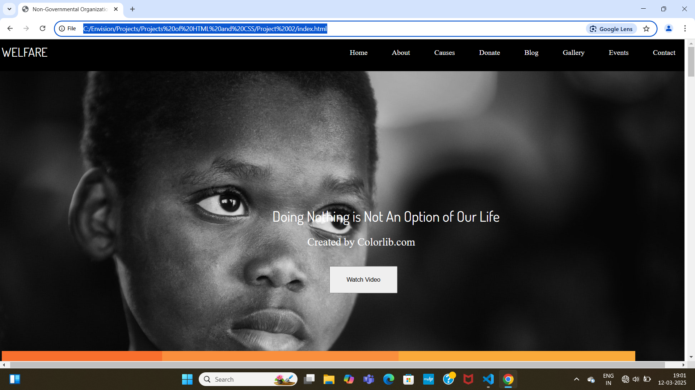

# 🌍 COMPANY Responsive Website

This is a **responsive COMPANY website** built using **HTML and CSS**.  
It is designed to raise awareness, showcase NGO activities, and encourage people to support through donations or volunteering.  

---

## 📌 Features
- Responsive design for desktop, tablet, and mobile 📱💻  
- Clean and modern UI  
- Sections included:  
  - ✅ Home / Hero Section  
  - ✅ About Us  
  - ✅ Our Services / Causes  
  - ✅ Gallery / Events  
  - ✅ Contact Form  
  - ✅ Footer with social links  

---

## 🛠️ Tech Stack
- **HTML5**  
- **CSS3** (Flexbox, Grid, Media Queries)  

---

## 📷 Screenshots
_Add project screenshots here (optional)._  
You can upload screenshots in a `/screenshots` folder and add them like this:  

```markdown


